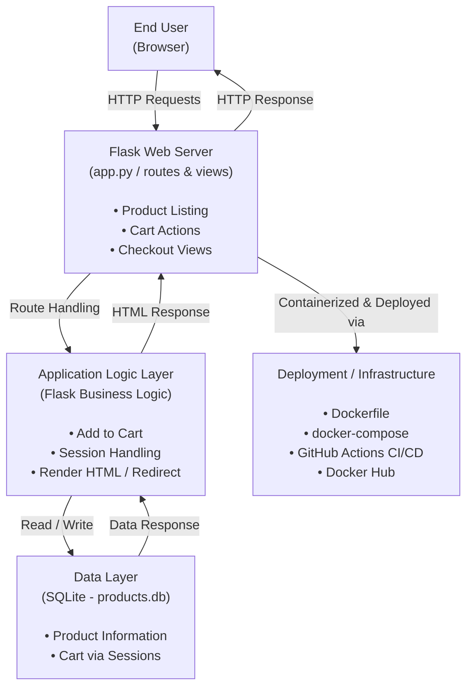

***My E-Commerce Store***

A simple e-commerce web application built with Flask, featuring product listing, image display, and a shopping cart.

Products use Unsplash image URLs, so no local images are needed. The cart functionality uses Flask sessions (no database required).

**Features**

- Display products with images, names, and prices

- Add products to cart

- View cart with items and total price

- Responsive UI using Bootstrap 5

- Lightweight and easy to extend

**Project Structure**
```
myecommerce-app/
├── app.py              # Main Flask application
├── db.py               # Optional database file (not required for cart)
├── products.db         # Optional database
├── templates/
│   ├── index.html      # Home page showing products
│   ├── cart.html       # Cart page showing selected items
│   └── checkout.html   # Checkout page (optional)
├── Dockerfile
├── Dockercompose.yaml
├── .github/workflows
    ├── main.yaml
├── venv/               # Python virtual environment
└── README.md           # This file
```
**Setup Instructions**
**1. Clone the repository **
```
git clone <your-repo-url>
cd myecommerce-app
```
**2. Create and activate virtual environment**
```
python -m venv venv
source venv/bin/activate      # Linux / macOS
venv\Scripts\activate         # Windows
```

**3. Install dependencies**
```
pip install flask
```
Flask is the only required dependency for this project.

**4. Run the application**
```
python app.py
```
You should see output like:
```
 * Running on http://127.0.0.1:5000/ (Press CTRL+C to quit)
```
**5. Open the application**
```
http://localhost:portnumber 0000/
```
- Browse products
- Add items to the cart
- Click “View Cart” to see selected items

**Notes**
- Product images are loaded via external URLs from Unsplash.
- Cart functionality uses Flask sessions, so cart data persists per browser session.
- To add more products, edit the products list in app.py.


### Run with docker

## Build image
```
docker build -t flask-ecommerce .

```
## Run container
```
docker run -p 5000:5000 flask-ecommerce
```

### Run Application Using Docker Compose
Docker Compose allows you to run the entire application using a single command.

## Start the Application
```
docker-compose up --build
```
After the container starts, access the application at:

```
http://localhost:5000
```

## Workflow Trigger
The pipeline runs automatically on:

- Push to main branch
- Pull request creation

## CI Pipeline Steps

- Checkout source code
- Login to Docker Hub using GitHub Secrets
- Build Docker image from Dockerfile
- Tag image (latest + commit SHA)
- Push image to Docker Hub repository

## GitHub Actions Workflow File

## Path:
```
.github/workflows/docker-build-push.yml
```
## Architecture



```mermaid

flowchart LR
    U[End User<br/>(Browser)]
    
    U -->|HTTP Request| F[Flask Web Application]
    
    F --> R[Flask Routes<br/>(app.py)]
    R --> T[Jinja2 Templates<br/>(HTML + Bootstrap)]
    R --> S[Session Management<br/>(Cart)]
    R --> D[(SQLite Database<br/>Products)]
    
    T --> U
```


